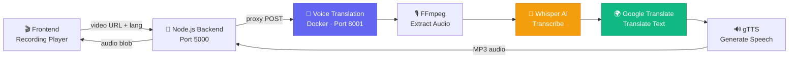

<div align="center">

# 🌐 ORBIT Voice Translation Service

<p>
  
  
  
  
  
</p>

<p>
  <strong>AI-powered real-time voice translation for class recordings</strong>
  <br />
  <em>Transcribe → Translate → Text-to-Speech — all in one pipeline</em>
</p>

<br/>

```
🎬 Video Input  →  🎙️ Audio Extract  →  📝 Transcribe  →  🌍 Translate  →  🔊 TTS Output
   (MP4/WebM)        (FFmpeg)            (Whisper AI)     (Google Trans)     (gTTS MP3)
```

</div>

---

## ✨ Features

| Feature | Description |
|---------|-------------|
| 🎙️ **AI Transcription** | Whisper `base` model with VAD for accurate speech-to-text |
| 🌍 **Multi-Language** | Telugu, Tamil, Kannada, Malayalam, Hindi + 10 more languages |
| 🔊 **Text-to-Speech** | Translated audio output via Google TTS |
| 📹 **WebM Support** | Handles browser-recorded webm files with timestamp fixes |
| ⚡ **REST API** | FastAPI with health checks, text translation, and full pipeline |
| 🐳 **Dockerized** | One-command deploy with pre-loaded Whisper model |

---

## 🏗️ Architecture



---

## 🚀 Quick Start

### Prerequisites

- **Docker** installed and running
- **Port 8001** available

### 1️⃣  Build & Run

```bash
# Build the Docker image
docker build -t orbit-voice-translation .

# Run the container
docker run -d --name orbit-vt -p 8001:8001 orbit-voice-translation
```

### 2️⃣  Verify

```bash
# Health check
curl http://localhost:8001/health
# → { "status": "healthy", "model": "base" }
```

### 3️⃣  Test Translation

```bash
# Quick text translation
curl -X POST http://localhost:8001/api/voice-translation/translate-text \
  -H "Content-Type: application/json" \
  -d '{"text": "Hello, welcome to class", "target_lang": "te"}'
```

---

## 📡 API Endpoints

| Method | Endpoint | Description |
|--------|----------|-------------|
| `GET` | `/health` | Service health check |
| `POST` | `/api/voice-translation/translate` | Full pipeline: video → translated audio |
| `POST` | `/api/voice-translation/translate-text` | Text-only translation |
| `POST` | `/api/voice-translation/translate-json` | Full pipeline with JSON response |

### Full Translation Request

```bash
curl -X POST http://localhost:8001/api/voice-translation/translate \
  -F "video_url=http://example.com/recording.webm" \
  -F "target_language=te"
```

**Response:** MP3 audio file with headers:
- `X-Original-Text` — transcribed English text
- `X-Translated-Text` — translated text
- `Content-Type: audio/mpeg`

---

## 🌍 Supported Languages

<div align="center">

| Code | Language | Code | Language |
|------|----------|------|----------|
| `te` | 🇮🇳 Telugu | `fr` | 🇫🇷 French |
| `ta` | 🇮🇳 Tamil | `de` | 🇩🇪 German |
| `kn` | 🇮🇳 Kannada | `es` | 🇪🇸 Spanish |
| `ml` | 🇮🇳 Malayalam | `zh` | 🇨🇳 Chinese |
| `hi` | 🇮🇳 Hindi | `ja` | 🇯🇵 Japanese |
| `ar` | 🇸🇦 Arabic | `ko` | 🇰🇷 Korean |
| `ru` | 🇷🇺 Russian | `pt` | 🇧🇷 Portuguese |
| `it` | 🇮🇹 Italian | `en` | 🇬🇧 English |

</div>

---

## 📂 Project Structure

```
voice_translation/
├── 📄 main.py              # FastAPI app entry point
├── 📄 routes.py             # API route definitions
├── 📄 service.py            # Core translation pipeline
├── 📄 requirements.txt      # Python dependencies
├── 🐳 Dockerfile            # Docker build configuration
├── 📄 test_voice_translation.py   # Pipeline test suite
├── 📄 test_multilang.py     # Multi-language test suite
└── 📄 .gitignore
```

---

## ⚙️ Pipeline Workflow

```
┌─────────────────────────────────────────────────────────────┐
│                    VOICE TRANSLATION PIPELINE                │
├─────────────────────────────────────────────────────────────┤
│                                                              │
│  1. 📥 DOWNLOAD          Download video from URL             │
│        │                                                     │
│  2. 🔍 PROBE             FFprobe checks for audio stream     │
│        │                                                     │
│  3. 🎵 EXTRACT           FFmpeg → 16kHz mono WAV             │
│        │                 + async resampling for WebM          │
│        │                                                     │
│  4. 🤖 TRANSCRIBE        Whisper AI (base model)             │
│        │                 + VAD filter (tuned params)          │
│        │                                                     │
│  5. 🌍 TRANSLATE         Google Translate API                │
│        │                 English → Target Language            │
│        │                                                     │
│  6. 🔊 TEXT-TO-SPEECH    Google TTS → MP3 audio              │
│        │                                                     │
│  7. 📤 RESPOND           Return MP3 + text headers           │
│                                                              │
└─────────────────────────────────────────────────────────────┘
```

---

## 🐳 Docker Commands

```bash
# Build
docker build -t orbit-voice-translation .

# Run (detached)
docker run -d --name orbit-vt -p 8001:8001 orbit-voice-translation

# View logs
docker logs orbit-vt --tail 20

# Stop & Remove
docker stop orbit-vt && docker rm orbit-vt

# Rebuild after code changes
docker rm -f orbit-vt && \
docker build -t orbit-voice-translation . && \
docker run -d --name orbit-vt -p 8001:8001 orbit-voice-translation
```

---

## ☁️ Azure Deployment

```bash
# Tag for Azure Container Registry
docker tag orbit-voice-translation <your-acr>.azurecr.io/orbit-voice-translation:latest

# Push to ACR
docker push <your-acr>.azurecr.io/orbit-voice-translation:latest

# Deploy to Azure App Service / Container Instance
az container create \
  --resource-group <rg-name> \
  --name orbit-voice-translation \
  --image <your-acr>.azurecr.io/orbit-voice-translation:latest \
  --ports 8001 \
  --cpu 2 --memory 4
```

---

## 🧪 Testing

```bash
# Run basic pipeline test
python test_voice_translation.py

# Run multi-language test (Telugu, Tamil, Kannada, Malayalam)
python test_multilang.py
```

---

<div align="center">

### Built with ❤️ for ORBIT

<p>
  
  
  
  
</p>

</div>