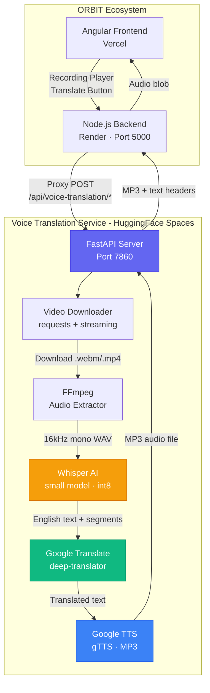

<div align="center">

# 🌐 ORBIT Voice Translation Service

<p>
  
  
  
  
  
</p>

<p>
  <strong>AI-powered real-time voice translation for class recordings</strong>
  <br />
  <em>Transcribe → Translate → Text-to-Speech — all in one pipeline</em>
</p>

<br/>

```
🎬 Video Input  →  🎙️ Audio Extract  →  📝 Transcribe  →  🌍 Translate  →  🔊 TTS Output
   (MP4/WebM)        (FFmpeg)            (Whisper AI)     (Google Trans)     (gTTS MP3)
```

</div>

---

## 🔗 Deployment & Repositories

| Resource | Link |
|----------|------|
| **Live API** | [`https://srikar048-orbit-voice-translation.hf.space`](https://srikar048-orbit-voice-translation.hf.space) |
| **Health Check** | [`https://srikar048-orbit-voice-translation.hf.space/health`](https://srikar048-orbit-voice-translation.hf.space/health) |
| **GitHub Repo** | [`Srikarsanka/orbittranslate`](https://github.com/Srikarsanka/orbittranslate) |
| **HF Space** | [`srikar048/orbit-voice-translation`](https://huggingface.co/spaces/srikar048/orbit-voice-translation) |
| **Parent Project** | [`Srikarsanka/orbitai`](https://github.com/Srikarsanka/orbitai) |

---

## ✨ Features

| Feature | Description |
|---------|-------------|
| 🎙️ **AI Transcription** | Whisper `small` model with VAD for accurate multilingual speech-to-text |
| 🌍 **16 Languages** | Telugu, Tamil, Kannada, Malayalam, Hindi, French, German, Spanish + 8 more |
| 🔊 **Text-to-Speech** | Translated audio output via Google TTS (gTTS) |
| 📹 **WebM Support** | Handles browser-recorded webm files with async timestamp fixes |
| 📝 **Timestamped Subtitles** | Returns segments with start/end times for subtitle rendering |
| ⚡ **REST API** | FastAPI with health checks, text translation, and full pipeline |
| 🐳 **Dockerized** | One-command deploy with pre-loaded Whisper model at build time |

---

## 🏗️ Architecture



### How It's Used in ORBIT

| Use Case | Flow |
|----------|------|
| **Translate Recording** | Student clicks "Translate" → Backend proxies to this service → Returns MP3 audio in target language |
| **Transcribe Subtitles** | Recording player requests subtitles → Service returns timestamped segments → Player renders captions |
| **Translate Subtitles** | Student switches language → Service translates each segment → Player updates captions |
| **Text Translation** | Quick text translation for UI elements via lightweight endpoint |

---

## ⚙️ Pipeline Workflow

```
┌──────────────────────────────────────────────────────────┐
│                 VOICE TRANSLATION PIPELINE                │
├──────────────────────────────────────────────────────────┤
│                                                           │
│  1. 📥 DOWNLOAD         Download video from Cloudinary    │
│        │                 URL (supports .webm, .mp4, .mp3) │
│        │                                                  │
│  2. 🔍 PROBE            FFprobe checks for audio stream   │
│        │                 (rejects silent videos)           │
│        │                                                  │
│  3. 🎵 EXTRACT          FFmpeg → 16kHz mono WAV           │
│        │                 + async resampling for WebM       │
│        │                 + speech padding (400ms)          │
│        │                                                  │
│  4. 🤖 TRANSCRIBE       Whisper AI (small model, int8)    │
│        │                 + VAD filter (300ms silence)      │
│        │                 + beam_size=5 for accuracy        │
│        │                                                  │
│  5. 🌍 TRANSLATE        Google Translate API               │
│        │                 Auto-detect source → target lang  │
│        │                                                  │
│  6. 🔊 TEXT-TO-SPEECH   Google TTS → MP3 audio            │
│        │                                                  │
│  7. 📤 RESPOND          Return MP3 + text headers         │
│                          Temp files auto-cleaned           │
│                                                           │
└──────────────────────────────────────────────────────────┘
```

---

## 📡 API Endpoints

| Method | Endpoint | Description |
|--------|----------|-------------|
| `GET` | `/health` | Service health check |
| `POST` | `/api/voice-translation/translate` | Full pipeline: video → translated MP3 audio |
| `POST` | `/api/voice-translation/translate-json` | Full pipeline via JSON body |
| `POST` | `/api/voice-translation/translate-text` | Text-only translation (lightweight) |
| `POST` | `/api/voice-translation/transcribe` | Timestamped transcript segments for subtitles |

### Example: Full Translation

```bash
curl -X POST https://srikar048-orbit-voice-translation.hf.space/api/voice-translation/translate \
  -F "video_url=https://res.cloudinary.com/xxx/video/upload/rec_abc.webm" \
  -F "target_language=te"
# Returns: MP3 audio file in Telugu
```

### Example: Text Translation

```bash
curl -X POST https://srikar048-orbit-voice-translation.hf.space/api/voice-translation/translate-text \
  -H "Content-Type: application/json" \
  -d '{"text": "Hello, welcome to class", "target_lang": "te"}'
```

### Example: Transcribe with Subtitles

```bash
curl -X POST https://srikar048-orbit-voice-translation.hf.space/api/voice-translation/transcribe \
  -H "Content-Type: application/json" \
  -d '{"videoUrl": "https://res.cloudinary.com/xxx/video/upload/rec_abc.webm", "lang": "te"}'
```

**Response:**
```json
{
  "success": true,
  "segments": [
    {"start": 0.0, "end": 3.5, "text": "Hello class", "translated": "హలో క్లాస్"},
    {"start": 3.5, "end": 7.2, "text": "Today we will learn arrays", "translated": "ఈ రోజు మనం arrays నేర్చుకుందాం"}
  ],
  "totalSegments": 2
}
```

---

## 🌍 Supported Languages

<div align="center">

| Code | Language | Code | Language |
|------|----------|------|----------|
| `te` | 🇮🇳 Telugu | `fr` | 🇫🇷 French |
| `ta` | 🇮🇳 Tamil | `de` | 🇩🇪 German |
| `kn` | 🇮🇳 Kannada | `es` | 🇪🇸 Spanish |
| `ml` | 🇮🇳 Malayalam | `zh` | 🇨🇳 Chinese |
| `hi` | 🇮🇳 Hindi | `ja` | 🇯🇵 Japanese |
| `ar` | 🇸🇦 Arabic | `ko` | 🇰🇷 Korean |
| `ru` | 🇷🇺 Russian | `pt` | 🇧🇷 Portuguese |
| `it` | 🇮🇹 Italian | `en` | 🇬🇧 English |

</div>

---

## 🚀 Local Development

```bash
cd backend/voice_translation
python -m venv venv
source venv/bin/activate  # Windows: venv\Scripts\activate
pip install -r requirements.txt
uvicorn main:app --host 0.0.0.0 --port 8001 --reload
```

## 🐳 Docker Deployment

```bash
docker build -t orbit-voice-translation .
docker run -d --name orbit-vt -p 8001:8001 orbit-voice-translation
curl http://localhost:8001/health
```

---

## 📂 Project Structure

```
voice_translation/
├── 📄 main.py                    # FastAPI app entry point + CORS
├── 📄 routes.py                  # API route definitions (translate, transcribe, text)
├── 📄 service.py                 # Core pipeline (download → extract → transcribe → translate → TTS)
├── 📄 requirements.txt           # Python dependencies
├── 🐳 Dockerfile                 # Docker build (HuggingFace-compatible, Whisper pre-downloaded)
├── 📄 test_voice_translation.py  # Pipeline test suite
├── 📄 test_multilang.py          # Multi-language test suite
└── 📄 .gitignore
```

---

<div align="center">

### Built with ❤️ for ORBIT Virtual Classroom

**Deployed on [Hugging Face Spaces](https://huggingface.co/spaces/srikar048/orbit-voice-translation)**

<p>
  
  
  
  
</p>

</div>